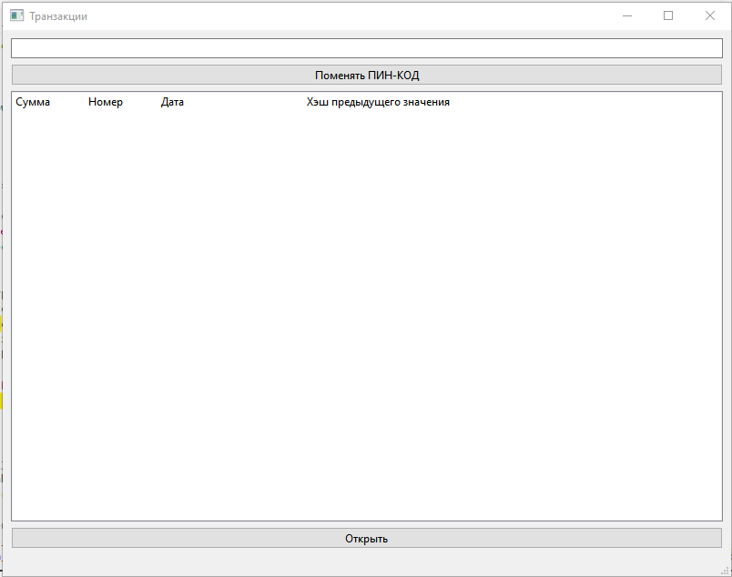
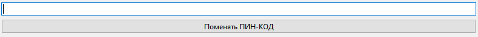
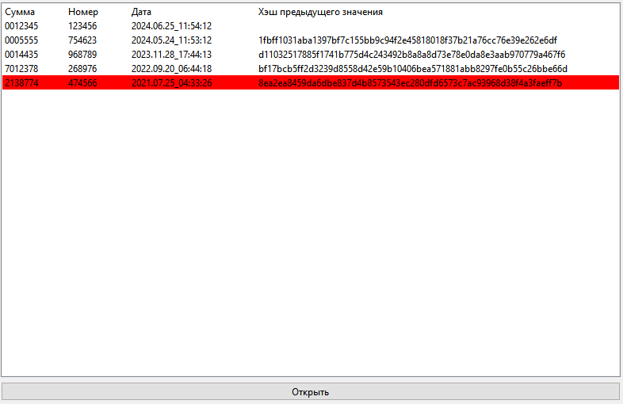

       # 221_329_Leshchinskii
       
       Приложение для хранения совершённых транзакций в зашифрованном виде.
       
       Приложение может расшифровывать файлы .json по предоставленному пин-коду (вводите его в строке наверху приложения).
       Также можно выбирать какой файл открыть, но если файл не подходит для вывода информаций про транзакции, то ничего не отобразится.

       Окно приложения
       

       Ввод пин-кода
       

       Отображение транзакций
       
       
       
